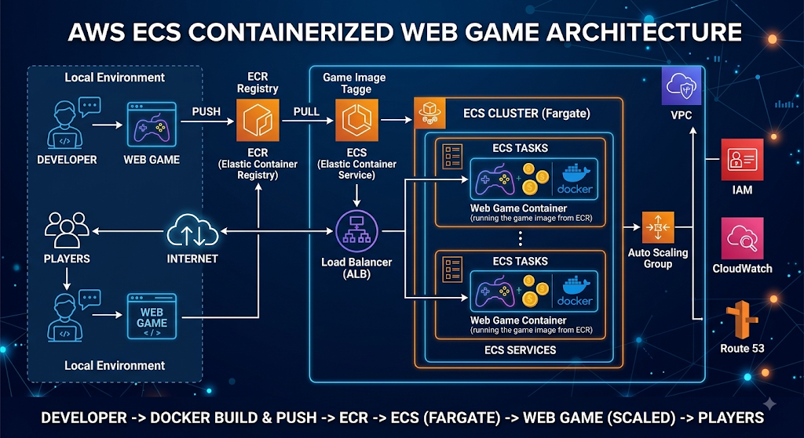

# AWS ECR & ECS — Containerized Web Application Deployment

## Project Overview

This project demonstrates an end-to-end containerized web application deployment on AWS using Docker, Amazon ECR, Amazon ECS, Application Load Balancer, Route 53, and AWS Certificate Manager.

The application is a lightweight Neon Snake Game built with HTML, CSS, and JavaScript and served through an Nginx container.

The project demonstrates practical implementation of:

Docker containerization
Amazon ECR image management
Amazon ECS cluster, task definition, and service
Application Load Balancer integration
Target group and health checks
IAM roles and permissions
VPC and Security Groups
Route 53 DNS configuration
ACM SSL/TLS certificate
HTTP → HTTPS redirection
End-to-end application troubleshooting
## Architecture
                         ┌─────────────────────┐
                         │       Internet      │
                         └──────────┬──────────┘
                                    │
                                    │ HTTPS
                                    ▼
                         ┌─────────────────────┐
                         │      Route 53       │
                         │        DNS          │
                         └──────────┬──────────┘
                                    │
                                    ▼
              ┌─────────────────────────────────────┐
              │       Application Load Balancer     │
              │                                     │
              │   HTTP :80  ──► HTTPS :443         │
              │   HTTPS :443 ──► Target Group       │
              └──────────────────┬──────────────────┘
                                 │
                                 │ HTTP
                                 ▼
                    ┌──────────────────────────┐
                    │      Target Group        │
                    │ Health Check: /          │
                    └────────────┬─────────────┘
                                 │
                                 ▼
                    ┌──────────────────────────┐
                    │       ECS Service        │
                    └────────────┬─────────────┘
                                 │
                                 ▼
                    ┌──────────────────────────┐
                    │        ECS Task           │
                    │                          │
                    │       Nginx :80          │
                    └────────────┬─────────────┘
                                 │
                                 ▼
                         Neon Snake Game

🔄 Container Image Lifecycle
Developer
    │
    ▼
GitHub Repository
    │
    ▼
EC2 Build Host
    │
    │ docker build
    ▼
Docker Image
    │
    │ docker tag
    │ docker push
    ▼
Amazon ECR
    │
    ▼
ECS Task Definition
    │
    ▼
ECS Service
    │
    ▼
Application Load Balancer
    │
    ▼
Route 53 + ACM
    │
    ▼
https://www.ankitdevops.xyz

### AWS Services Used
AWS Service	Purpose
Amazon EC2	Docker build and deployment workstation
AWS IAM	Identity and access management
Amazon ECR	Private Docker image registry
Amazon ECS	Container orchestration
Application Load Balancer	Application traffic distribution
Target Group	ECS task registration and health checks
Route 53	DNS management
AWS Certificate Manager	SSL/TLS certificate
VPC	Network isolation
Security Groups	Network access control
CloudWatch	Monitoring and logging
### 📂 Repository Structure
aws-cloud-projects/
│
└── ecr-ecs/
    │
    ├── DockerFile
    ├── index.html
    ├── style.css
    ├── script.js
    ├── taskdefination.json
    └── README.md

GitHub repository:

https://github.com/bhange-saheb/aws-cloud-projects

Project directory:

aws-cloud-projects/ecr-ecs

### 1. Prerequisites

Before starting, make sure you have:

AWS account
GitHub account
Registered domain
SSH key pair
Basic Linux knowledge
Basic Docker knowledge

Example AWS region:

AWS_REGION=us-east-1

Example variables:

AWS_ACCOUNT_ID=<YOUR_AWS_ACCOUNT_ID>
ECR_REPOSITORY=ankit-game
AWS_REGION=us-east-1

The final ECR image URI will look like:

<YOUR_AWS_ACCOUNT_ID>.dkr.ecr.us-east-1.amazonaws.com/ankit-game:latest

### 2. Create EC2 Instance

The EC2 instance is used as the Docker build and ECR push machine.

Go to:

AWS Console
→ EC2
→ Instances
→ Launch Instance

Example configuration:

Name:
ecr-ecs-build-server

AMI:
Amazon Linux

Instance Type:
t3.micro

Create or select an SSH key pair.

Security Group

Allow SSH:

Type: SSH
Protocol: TCP
Port: 22
Source: My IP

For this EC2 build machine, you do not need to expose ports 80 or 443 publicly.

### 3. Create IAM Role for EC2

Go to:

AWS Console
→ IAM
→ Roles
→ Create role

Select:

Trusted entity:
AWS service

Use case:
EC2

Role name:

ecr-ecs-role

Attach:

AmazonEC2ContainerRegistryFullAccess
AmazonS3FullAccess

Security Note

These are broad managed policies and are acceptable for a learning project.

For production, use least-privilege IAM policies limited to the specific ECR repositories and S3 resources required.

### 4. Attach IAM Role to EC2

Go to:

EC2
→ Instances
→ Select Instance
→ Actions
→ Security
→ Modify IAM role

Select:

ecr-ecs-role

Save the configuration.

The architecture is now:

EC2
 │
 ▼
IAM Instance Role
 │
 ▼
Temporary AWS Credentials
 │
 ▼
AWS CLI / ECR

No permanent AWS access keys need to be stored on the EC2 instance.

### 5. Connect to EC2

From your local system:

ssh -i <your-key.pem> ec2-user@<EC2_PUBLIC_IP>

Verify AWS authentication:

aws sts get-caller-identity

You should see the AWS account and IAM role information.

### 6. Install AWS CLI

Check whether AWS CLI is already installed:

aws --version

If it is not installed, install AWS CLI according to the AWS CLI installation method for your EC2 operating system.

Verify:

aws --version

### 7. Install Docker

Install Docker:

sudo yum install -y docker

Start Docker:

sudo systemctl start docker

Enable Docker at boot:

sudo systemctl enable docker

Check:

docker --version

Check service:

sudo systemctl status docker

Allow the EC2 user to execute Docker:

sudo usermod -aG docker ec2-user

Log out and reconnect.

Verify:

docker ps

### 8. Install Git

Install Git:

sudo yum install -y git

Verify:

git --version

### 9. Clone GitHub Repository

Clone the repository:

git clone https://github.com/bhange-saheb/aws-cloud-projects.git

Navigate into the repository:

cd aws-cloud-projects

Enter the project:

cd ecr-ecs

Verify the files:

ls -la

Expected:

DockerFile
index.html
style.css
script.js
taskdefination.json

### 10. Understand the Application

The application consists of:

index.html

Application structure and game UI.

style.css

Game styling and neon visual effects.

script.js

Snake game functionality.

DockerFile

Packages the application into an Nginx container.

taskdefination.json

Defines how ECS should run the container.

### 11. Dockerfile

The application is served using Nginx Alpine.

FROM nginx:alpine

LABEL maintainer="Ankit Bhange"
LABEL description="Ankit's Neon Snake Game"

RUN apk add --no-cache curl net-tools jq

COPY index.html /usr/share/nginx/html/
COPY style.css /usr/share/nginx/html/
COPY script.js /usr/share/nginx/html/

RUN chmod 644 /usr/share/nginx/html/index.html \
    /usr/share/nginx/html/style.css \
    /usr/share/nginx/html/script.js

EXPOSE 80

CMD ["nginx", "-g", "daemon off;"]

Container Port

Nginx listens on:

80

Therefore the ECS container port is:

80

The chmod 644 commands are not normally required for standard static files, but they explicitly guarantee that the files are readable.

### 12. Build Docker Image

From:

aws-cloud-projects/ecr-ecs

run:

docker build -f DockerFile -t ankit-game .

Verify:

docker images

Expected:

REPOSITORY
ankit-game

### 13. Test Docker Container Locally

Run:

docker run -d \
  --name ankit-game-test \
  -p 8080:80 \
  ankit-game

Check:

docker ps

Expected mapping:

0.0.0.0:8080->80/tcp

Test:

curl http://localhost:8080

The mapping is:

EC2 Host :8080
      │
      ▼
Container :80
      │
      ▼
Nginx

Stop and remove the test container:

docker rm -f ankit-game-test

### 14. Create Amazon ECR Repository

Go to:

AWS Console
→ Amazon ECR
→ Repositories
→ Create repository

Repository name:

ankit-game

Recommended:

Visibility:
Private

Or use AWS CLI:

aws ecr create-repository \
  --repository-name ankit-game \
  --region us-east-1

Verify:

aws ecr describe-repositories \
  --repository-names ankit-game \
  --region us-east-1

### 15. Authenticate Docker with ECR

Run:

aws ecr get-login-password \
  --region us-east-1 | \
docker login \
  --username AWS \
  --password-stdin \
  <YOUR_AWS_ACCOUNT_ID>.dkr.ecr.us-east-1.amazonaws.com

Expected:

Login Succeeded

### 16. Tag Docker Image

Tag the image:

docker tag \
  ankit-game:latest \
  <YOUR_AWS_ACCOUNT_ID>.dkr.ecr.us-east-1.amazonaws.com/ankit-game:latest

Verify:

docker images

You should now have:

ankit-game:latest

<YOUR_AWS_ACCOUNT_ID>.dkr.ecr.us-east-1.amazonaws.com/ankit-game:latest

### 17. Push Image to ECR

Push:

docker push \
  <YOUR_AWS_ACCOUNT_ID>.dkr.ecr.us-east-1.amazonaws.com/ankit-game:latest

Verify from AWS:

AWS Console
→ ECR
→ Repositories
→ ankit-game
→ Images

The image should appear as:

latest

Verify using CLI:

aws ecr list-images \
  --repository-name ankit-game \
  --region us-east-1

### 18. Create ECS Cluster

Go to:

AWS Console
→ ECS
→ Clusters
→ Create cluster

Example:

Cluster Name:
ankit-game-cluster

Launch Type

The current project task definition uses:

"networkMode": "bridge"

This is suitable for ECS using the EC2 launch type.

If using Fargate, use:

"networkMode": "awsvpc"

and configure the task accordingly.

For this project, keep the ECS launch type and task-definition networking mode consistent.

### 19. Create ECS Task Execution Role

ECS needs permission to pull the private ECR image.

Go to:

IAM
→ Roles
→ Create role

Trusted entity:

AWS Service
→ Elastic Container Service
→ ECS Task

Attach:

AmazonECSTaskExecutionRolePolicy

Example role:

ecsTaskExecutionRole

IAM Role Separation

The EC2 role and ECS task execution role have different responsibilities:

EC2 IAM Role
    │
    ├── AWS CLI
    └── ECR operations

ECS Task Execution Role
    │
    ├── Pull image from ECR
    └── CloudWatch Logs

### 20. Create ECS Task Definition

Go to:

ECS
→ Task Definitions
→ Create new task definition

Family:

ankit-game

Configure the task according to the selected ECS launch type.

Add container:

Container Name:
ankit-game

Image:

<YOUR_AWS_ACCOUNT_ID>.dkr.ecr.us-east-1.amazonaws.com/ankit-game:latest

Container port:

80

Protocol:

TCP

Memory:

256 MB

CPU:

256

Execution role:

ecsTaskExecutionRole

### 21. Task Definition JSON

The project contains:

taskdefination.json

Example structure:

{
  "family": "ankit-game",
  "networkMode": "bridge",
  "containerDefinitions": [
    {
      "name": "ankit-game",
      "image": "<AWS_ACCOUNT_ID>.dkr.ecr.us-east-1.amazonaws.com/ankit-game:latest",
      "cpu": 256,
      "memory": 256,
      "essential": true,
      "portMappings": [
        {
          "containerPort": 80,
          "protocol": "tcp"
        }
      ]
    }
  ]
}

Replace the image URI with the ECR image created earlier.

### 22. Create Target Group

Go to:

EC2
→ Target Groups
→ Create target group

Example:

Target Group:
ankit-game-tg

Protocol:

HTTP 
 

Health check protocol:

HTTP

Health check path:

/

Expected health response:

HTTP 200

The target group is responsible for determining whether the ECS task is healthy.

### 23. Create Application Load Balancer

Go to:

EC2
→ Load Balancers
→ Create Load Balancer

Choose:

Application Load Balancer

Example name:

ankit-game-alb

Scheme:

Internet-facing

Select the appropriate VPC and subnets.

For production, use subnets in multiple Availability Zones.

### 24. ALB Security Group

Create/select the ALB security group.

Allow:

HTTP
TCP
80
Source: 0.0.0.0/0

and later:

HTTPS
TCP
443
Source: 0.0.0.0/0

The ALB is the public entry point.

### 25. Create ECS Service

Go to:

ECS
→ Clusters
→ ankit-game-cluster
→ Services
→ Create

Select:

Task Definition:
ankit-game

Desired tasks:

1

Select the appropriate ECS launch type.

### 26. Configure ECS Load Balancing

Enable:

Application Load Balancer

Select:

Load Balancer:
ankit-game-alb

Target group:

ankit-game-tg

Container:

ankit-game

Container port:

80

The ECS service will automatically register the task with the target group.

### 27. ECS Task Security Group

The ECS task should accept traffic from the ALB security group.

For Nginx:

Inbound:
TCP
Port: 80
Source: ALB Security Group

Avoid:

TCP 80
0.0.0.0/0

when the ALB is the intended public entry point.

The secure traffic path is:

Internet
    │
    ▼
ALB
    │
    ▼
ALB Security Group
    │
    ▼
ECS Security Group
    │
    ▼
Nginx :80

### 28. Verify ECS Service

Go to:

ECS
→ Clusters
→ ankit-game-cluster
→ Services
→ ankit-game

Check:

Desired count: 1
Running count: 1
Pending count: 0

If a task stops:

ECS
→ Service
→ Tasks
→ Stopped

Check the stopped reason.

### 29. Verify Target Group

Go to:

EC2
→ Target Groups
→ ankit-game-tg
→ Targets

The ECS task should become:

Healthy

If it is unhealthy, verify:

Container port
Target group configuration
Health check path
ECS security group
ALB security group
ECS task status
Nginx status
### 30. Test Application Using ALB DNS

Go to:

EC2
→ Load Balancers
→ ankit-game-alb

Copy the ALB DNS name.

Example:

ankit-game-alb-xxxxxxxx.us-east-1.elb.amazonaws.com

Test:

http://ankit-game-alb-xxxxxxxx.us-east-1.elb.amazonaws.com

The application should load.

### 31. Configure Route 53

Go to:

Route 53
→ Hosted zones
→ Create hosted zone

Domain:

ankitdevops.xyz

Type:

Public hosted zone

If the domain is registered outside Route 53, update its nameservers at your domain registrar with the Route 53 nameservers.

### 32. Create Route 53 DNS Record

Create:

Name:
www

Type:
A

Alias:
Yes

Alias target:

Application Load Balancer

Select:

ankit-game-alb

The DNS architecture is:

www.ankitdevops.xyz
        │
        ▼
     Route 53
        │
        ▼
Application Load Balancer

Do not point Route 53 directly to an ECS task IP.

### 33. Request ACM Certificate

Go to:

AWS Certificate Manager
→ Request
→ Request a public certificate

Domain:

www.ankitdevops.xyz

Optionally include:

ankitdevops.xyz

Choose:

DNS Validation

Create the certificate.

### 34. Validate ACM Certificate

ACM will provide a DNS validation record.

If Route 53 manages the domain, create the validation record in Route 53.

Wait until:

Certificate Status:
Issued

The ACM certificate must be in the same AWS region as the ALB.

### 35. Create HTTPS :443 Listener

Go to:

EC2
→ Load Balancers
→ ankit-game-alb
→ Listeners and rules
→ Add listener

Configure:

Protocol:
HTTPS

Port:
443

Select the ACM certificate:

www.ankitdevops.xyz

Default action:

Forward to:
ankit-game-tg

Save.

The architecture becomes:

HTTPS :443
      │
      ▼
ACM Certificate
      │
      ▼
Target Group
      │
      ▼
ECS Task :80

### 36. Redirect HTTP → HTTPS

Configure the HTTP listener:

HTTP :80

Default action:

Redirect

Configure:

Protocol:
HTTPS

Port:
443

Status Code:
HTTP_301

Final listener configuration:

HTTP :80
    │
    │ HTTP 301
    ▼
HTTPS :443
    │
    │ Forward
    ▼
ankit-game-tg
    │
    ▼
ECS Task :80

Now:

http://www.ankitdevops.xyz

automatically redirects to:

https://www.ankitdevops.xyz

### 37. Final Security Group Configuration
ALB Security Group

Inbound:

HTTP
TCP 80
0.0.0.0/0

HTTPS
TCP 443
0.0.0.0/0

Outbound:

All traffic

ECS Security Group

Inbound:

TCP 80
Source:
ALB Security Group

This prevents direct public access to the ECS application.

### 38. Final End-to-End Request Flow
Browser
   │
   │ https://www.ankitdevops.xyz
   ▼
Route 53
   │
   ▼
Application Load Balancer
   │
   │ HTTPS :443
   ▼
ACM Certificate
   │
   │ TLS Termination
   ▼
Target Group
   │
   ▼
ECS Service
   │
   ▼
ECS Task
   │
   │ HTTP :80
   ▼
Nginx
   │
   ▼
Neon Snake Game

### 39. Why :8000 Is Not Required

A common mistake is accessing:

https://www.ankitdevops.xyz:8000

Port 8000 is not required for the final architecture.

The public HTTPS port is:

443

The internal container port is:

80

Therefore:

Internet
   │
   │ HTTPS :443
   ▼
ALB
   │
   │ HTTP
   ▼
ECS :80

The user accesses:

https://www.ankitdevops.xyz

not:

https://www.ankitdevops.xyz:8000

### Useful Docker Commands

Check running containers:

docker ps

Check all containers:

docker ps -a

List images:

docker images

Build:

docker build -f DockerFile -t ankit-game .

Run:

docker run -d \
  --name ankit-game-test \
  -p 8080:80 \
  ankit-game

View logs:

docker logs ankit-game-test

Enter container:

docker exec -it ankit-game-test sh

Stop:

docker stop ankit-game-test

Remove:

docker rm ankit-game-test

### Useful ECR Commands

Login:

aws ecr get-login-password \
  --region us-east-1 | \
docker login \
  --username AWS \
  --password-stdin \
  <AWS_ACCOUNT_ID>.dkr.ecr.us-east-1.amazonaws.com

List repositories:

aws ecr describe-repositories \
  --region us-east-1

List images:

aws ecr list-images \
  --repository-name ankit-game \
  --region us-east-1

### Troubleshooting
ECR Login Failed

Check:

aws sts get-caller-identity

Verify that the EC2 IAM role has ECR permissions.

Docker Push Permission Denied

Verify:

IAM role
ECR repository name
AWS region
AWS account ID
Docker login
ECS Task Does Not Start

Check:

ECS
→ Cluster
→ Service
→ Tasks
→ Stopped

Common causes:

Incorrect ECR image URI
Missing ECS execution role
ECR permission problem
Invalid task definition
Incorrect CPU/memory
Incorrect networking configuration
Target Group Shows Unhealthy

Check:

Target Group
→ Targets

Verify:

Health Check:
/

Protocol:
HTTP

Container Port:
80

Also verify security groups.

ALB Does Not Respond

Check:

ALB is internet-facing
ALB subnets are configured correctly
Security group allows 80/443
Listener exists
Target group has healthy targets
HTTP Works but HTTPS Does Not

Check:

ALB
→ Listeners

You should have:

HTTP :80
HTTPS :443

Verify the ACM certificate:

Status:
Issued

Verify security group:

TCP 443
0.0.0.0/0

HTTP Does Not Redirect to HTTPS

Verify the HTTP listener's default action:

HTTP :80
       │
       ▼
Redirect
       │
       ▼
HTTPS :443

Status code:

HTTP_301

Domain Does Not Resolve

Check:

nslookup www.ankitdevops.xyz

or:

dig www.ankitdevops.xyz

Verify:

Route 53 hosted zone
Nameservers
A record
ALB Alias target
https://www.ankitdevops.xyz:8000 Does Not Work

This is expected if port 8000 is configured for HTTP.

HTTPS requires a TLS listener.

The recommended configuration is:

Client
   │
   │ HTTPS :443
   ▼
ALB
   │
   │ HTTP
   ▼
ECS :80

Therefore use:

https://www.ankitdevops.xyz

## Production Improvements

This project can be evolved into a production-grade deployment by adding:

CI/CD
GitHub
   │
   ▼
GitHub Actions
   │
   ├── Test
   ├── Docker Build
   ├── Security Scan
   ├── Push → ECR
   └── Deploy → ECS

Infrastructure as Code

Implement AWS infrastructure using:

Terraform
AWS CloudFormation
AWS CDK
Security

Implement:

Least-privilege IAM
AWS WAF
Private ECS subnets
Secrets Manager
Systems Manager
ECR vulnerability scanning
ECR lifecycle policies
Reliability

Implement:

ECS Auto Scaling
Multi-AZ deployment
ALB health checks
CloudWatch alarms
Rolling deployments
Blue/Green deployments
Observability

Implement:

CloudWatch Logs
CloudWatch Metrics
ALB access logs
Container health monitoring
Application alarms
## Deployment Checklist

Use this checklist when deploying the project from scratch:

- [ ] AWS account created
- [ ] EC2 instance created
- [ ] IAM role created
- [ ] ECR permissions attached
- [ ] IAM role attached to EC2
- [ ] AWS CLI installed
- [ ] Docker installed
- [ ] Git installed
- [ ] Repository cloned
- [ ] Docker image built
- [ ] Local container tested
- [ ] ECR repository created
- [ ] Docker authenticated with ECR
- [ ] Image tagged
- [ ] Image pushed to ECR
- [ ] ECS cluster created
- [ ] ECS task execution role created
- [ ] ECS task definition created
- [ ] Target group created
- [ ] ALB created
- [ ] ALB security group configured
- [ ] ECS service created
- [ ] ECS service attached to target group
- [ ] ECS task healthy
- [ ] Target group healthy
- [ ] ALB DNS tested
- [ ] Route 53 hosted zone configured
- [ ] Route 53 A/AAAA Alias created
- [ ] ACM certificate requested
- [ ] ACM certificate validated
- [ ] HTTPS :443 listener created
- [ ] HTTP :80 → HTTPS :443 redirect configured
- [ ] Final HTTPS endpoint tested

# Key DevOps Concepts Demonstrated

This project demonstrates practical experience with:

Containerization
Docker
Dockerfile
Nginx
Image lifecycle
Container networking
AWS Container Registry
ECR repository
Docker authentication
Image tagging
Image versioning
Image deployment
Container Orchestration
ECS clusters
ECS task definitions
ECS services
Desired task count
Task lifecycle
Load Balancing
Application Load Balancer
Listeners
Target groups
Health checks
HTTP → HTTPS redirection
Networking
VPC
Subnets
Security groups
DNS
Public/private traffic flow
Security
IAM roles
Temporary AWS credentials
Least-privilege architecture
TLS certificates
Security group isolation
DNS & TLS
Route 53
Alias records
ACM
DNS validation
HTTPS termination
## Production Architecture Evolution

The current project provides a foundation that can evolve into:

                         GitHub
                            │
                            ▼
                     GitHub Actions
                            │
                     Docker Build
                            │
                            ▼
                         ECR
                            │
                            ▼
                     ECS Deployment
                            │
                 ┌──────────┴──────────┐
                 │                     │
              ECS Task              ECS Task
                 │                     │
                 └──────────┬──────────┘
                            │
                            ▼
                           ALB
                            │
                         AWS WAF
                            │
                            ▼
                         Route 53
                            │
                            ▼
                         Internet

This provides a natural path toward a complete CI/CD + container orchestration + infrastructure-as-code + observability solution.

# What I Learned

This project provided hands-on experience designing and deploying a complete AWS containerized application.

Key areas implemented:

Docker image creation and testing
Amazon ECR image management
ECS cluster and service deployment
ECS task definition configuration
Application Load Balancer integration
Target group health checks
IAM role-based AWS authentication
Security group design
Route 53 DNS management
ACM certificate management
HTTPS/TLS termination
HTTP-to-HTTPS redirection
Container and network troubleshooting
AWS architecture and deployment workflow
👨‍💻 Author
Ankit Bhange

AWS | DevOps | Cloud | Docker | ECS | ECR

GitHub:

https://github.com/bhange-saheb/aws-cloud-projects

Project:

AWS ECR & ECS — Neon Snake Game

⭐ Project Outcome

The final application is deployed as a Docker container running on Amazon ECS.

The Docker image is stored in Amazon ECR.

Application traffic is handled by an Application Load Balancer.

DNS is managed using Route 53.

HTTPS is implemented using AWS Certificate Manager.

HTTP traffic is redirected to HTTPS.

🌐 Final Application
https://www.ankitdevops.xyz

Final Request Flow
User
 │
 │ HTTPS :443
 ▼
Route 53
 │
 ▼
Application Load Balancer
 │
 ├── HTTP :80 → HTTPS :443
 │
 └── HTTPS :443
          │
          ▼
      ACM Certificate
          │
          ▼
      Target Group
          │
          ▼
      ECS Service
          │
          ▼
       ECS Task
          │
          ▼
       Nginx :80
          │
          ▼
    Neon Snake Game

⚠️ Security & Cost Notice

This project is intended as a learning and portfolio project.

Before using this architecture in production:

Replace broad IAM policies with least-privilege policies.
Avoid exposing ECS tasks directly to the internet.
Use private subnets where appropriate.
Enable monitoring and alerting.
Use immutable container image tags.
Enable ECR image scanning.
Protect the ALB using AWS WAF where appropriate.
Review and remove unused AWS resources to avoid unnecessary charges.

Built with AWS, Docker, Nginx, HTML, CSS, and JavaScript.