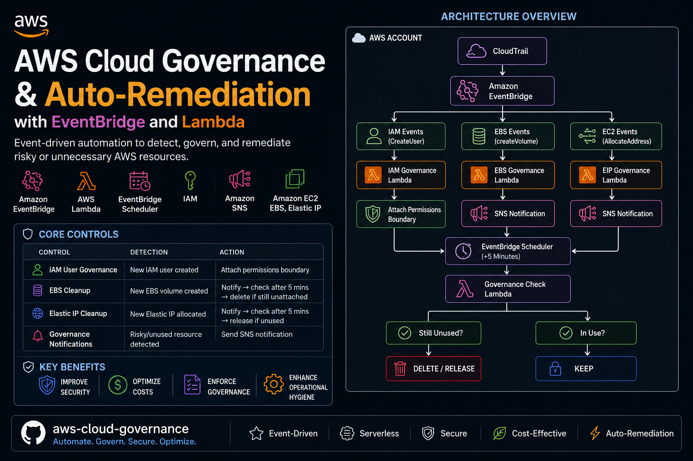

# AWS Cloud Governance & Auto-Remediation with EventBridge and Lambda


A serverless AWS governance and auto-remediation project that uses **Amazon EventBridge, AWS Lambda, EventBridge Scheduler, IAM, Amazon SNS, Amazon EC2, EBS, and Elastic IPs** to automatically detect and remediate potentially unnecessary or risky cloud resources.

The project demonstrates how event-driven automation can be used to improve **AWS security, cost optimization, resource governance, and operational hygiene**.


---

## Project Overview

Cloud environments can accumulate unnecessary resources and security risks over time, such as:

* Unattached EBS volumes
* Unused Elastic IP addresses
* IAM users without appropriate permissions boundaries
* Overly permissive IAM configurations
* Resources without required governance tags

This project implements an event-driven solution that detects these conditions and automatically takes corrective action.

### Core Controls

| Control                  | Detection                      | Action                                                      |
| ------------------------ | ------------------------------ | ----------------------------------------------------------- |
| IAM User Governance      | New IAM user created           | Attach permissions boundary                                 |
| EBS Cleanup              | New EBS volume created         | Notify → check after 5 minutes → delete if still unattached |
| Elastic IP Cleanup       | New Elastic IP allocated       | Notify → check after 5 minutes → release if unused          |
| Governance Notifications | Risky/unused resource detected | Send SNS notification                                       |

---

# Architecture

```text
                         AWS ACCOUNT
                              |
                              |
                       ┌──────────────┐
                       │  CloudTrail  │
                       └──────┬───────┘
                              |
                              ▼
                      ┌───────────────┐
                      │  EventBridge  │
                      └───────┬───────┘
                              |
             ┌────────────────┼─────────────────┐
             │                │                 │
             ▼                ▼                 ▼
        IAM Events        EBS Events        EC2 Events
             │                │                 │
             ▼                ▼                 ▼
      IAM Governance     EBS Governance    EIP Governance
         Lambda             Lambda            Lambda
             │                │                 │
             ▼                ▼                 ▼
     Permissions         SNS Notification    SNS Notification
       Boundary                │                 │
                                ▼                 ▼
                       EventBridge Scheduler
                                │
                             +5 Minutes
                                │
                                ▼
                              Lambda
                                │
                       ┌────────┴────────┐
                       │                 │
                  Still unused?       In use?
                       │                 │
                      YES               YES
                       │                 │
                       ▼                 ▼
                    DELETE             KEEP
```

---

#  AWS Services Used

### Amazon EventBridge

Used as the event-driven entry point for detecting AWS API/resource events.

Examples:

* IAM `CreateUser`
* EBS `createVolume`
* EC2 `AllocateAddress`

### AWS Lambda

Serverless Python functions perform governance checks and remediation.

### EventBridge Scheduler

Used to perform delayed checks without keeping a Lambda function running.

For example:

```text
Resource created
      ↓
EventBridge
      ↓
Lambda
      ↓
Schedule check
      ↓
5 minutes
      ↓
Lambda
      ↓
Check resource
```

This is preferable to using:

```python
time.sleep(300)
```

inside Lambda.

### IAM

Used for:

* Permissions boundaries
* Lambda execution roles
* Scheduler execution roles
* Least-privilege access

### Amazon SNS

Used for governance and cleanup notifications.

### Amazon EC2 / EBS

Used to detect and manage:

* EBS volumes
* Elastic IP addresses

---

# Recommended Repository Structure

```text
aws-cloud-governance/
│
├── README.md
│
├── iam-governance/
│   ├── lambda_function.py
│   └── event-pattern.json
│
├── ebs-governance/
│   ├── lambda_function.py
│   └── event-pattern.json
│
├── eip-governance/
│   ├── lambda_function.py
│   └── event-pattern.json
│
├── iam/
│   ├── lambda-execution-policy.json
│   ├── scheduler-role-policy.json
│   └── permissions-boundary.json
│
├── eventbridge/
│   ├── iam-rule.json
│   ├── ebs-rule.json
│   └── eip-rule.json
```

---

# 1. IAM Governance

## Objective

Automatically apply a permissions boundary to newly created IAM users.

The permissions boundary limits the maximum permissions that the IAM user can receive.

In this project, the boundary allows:

```text
EC2
S3
```

### Flow

```text
IAM CreateUser
      ↓
CloudTrail
      ↓
EventBridge
      ↓
Lambda
      ↓
PutUserPermissionsBoundary
      ↓
IAM User
```

---

## Permissions Boundary

Example policy:

```json
{
    "Version": "2012-10-17",
    "Statement": [
        {
            "Sid": "AllowEC2",
            "Effect": "Allow",
            "Action": "ec2:*",
            "Resource": "*"
        },
        {
            "Sid": "AllowS3",
            "Effect": "Allow",
            "Action": "s3:*",
            "Resource": "*"
        }
    ]
}
```

> Note: A permissions boundary does not grant permissions by itself. It establishes the maximum permissions that identity-based policies can grant.

---

#  2. EventBridge IAM Rule

Create an EventBridge rule for IAM user creation.

Amazon EventBridge -> Rules -> Create rule

1. Give name of rule and desctiption. Select event bus ( for project I have used default)
2. Build event pattern -> others -> custom json  ( paste rule.json for different rule eg iam-rule.json for IAM, ebs-rule.json for EBS etc)
3. Select target(s) -> select the lambda functions for respective work. 
4. Optional ()
5. review and create.

Example event pattern:

```json
{
    "source": [
        "aws.iam"
    ],
    "detail-type": [
        "AWS API Call via CloudTrail"
    ],
    "detail": {
        "eventSource": [
            "iam.amazonaws.com"
        ],
        "eventName": [
            "CreateUser"
        ]
    }
}
```

Set the Lambda function as the target.

---

#  3. IAM Lambda Function

Lambda -> Functions -> Create function

1. Give function name and select runtime python ( as python I have used in this project)
2. Deploy the code.
3. Permission -> click on automatically created Role -> add required policy ( available in /iam/*.JSON )

Example:

```python
import boto3
import json
import os

iam = boto3.client("iam")

BOUNDARY_POLICY_ARN = os.environ["BOUNDARY_POLICY_ARN"]


def lambda_handler(event, context):

    print(json.dumps(event))

    detail = event.get("detail", {})

    request_parameters = detail.get(
        "requestParameters", {}
    )

    username = request_parameters.get("userName")

    if not username:
        print("Username not found")
        return

    print(f"New IAM user detected: {username}")

    iam.put_user_permissions_boundary(
        UserName=username,
        PermissionsBoundary=BOUNDARY_POLICY_ARN
    )

    print(
        f"Permissions boundary attached to {username}"
    )
```

---

# 4. EBS Governance

## Objective

Detect newly created EBS volumes and automatically clean up unused volumes.

### Policy

```text
EBS volume created
        ↓
EventBridge
        ↓
Lambda
        ↓
Check volume
        ↓
Send notification
        ↓
Schedule check after 5 minutes
        ↓
Check volume again
        ↓
       ┌───────────────┐
       │               │
   available         in-use
       │               │
       ▼               ▼
    DELETE            KEEP
```

---

# EBS EventBridge Rule

Example:

```json
{
    "source": [
        "aws.ec2"
    ],
    "detail-type": [
        "EBS Volume Notification"
    ],
    "detail": {
        "event": [
            "createVolume"
        ],
        "result": [
            "available"
        ]
    }
}
```

---

# Why EventBridge Scheduler?

A common but inefficient approach is:

```python
time.sleep(300)
```

This keeps the Lambda execution running while it waits.

Instead:

```text
Lambda
  ↓
Create one-time Scheduler
  ↓
5 minutes
  ↓
Lambda invoked again
  ↓
Check EBS volume
```

Benefits:

* Lower Lambda execution cost
* No unnecessary waiting
* Better scalability
* Cleaner event-driven architecture
* Easier to troubleshoot

---

# EBS Cleanup Logic

The Lambda checks:

```text
Volume exists?
       │
       ▼
Volume state?
       │
 ┌─────┴─────┐
 │           │
available   in-use
 │           │
 ▼           ▼
delete      keep
```

Example:

```python
response = ec2.describe_volumes(
    VolumeIds=[volume_id]
)

volume = response["Volumes"][0]

if volume["State"] == "available":

    ec2.delete_volume(
        VolumeId=volume_id
    )

elif volume["State"] == "in-use":

    print("Volume is attached. Keeping it.")
```

---

# 5. Elastic IP Governance

## Objective

Detect Elastic IP allocations and identify addresses that remain unused.

### Flow

```text
AllocateAddress
      ↓
CloudTrail
      ↓
EventBridge
      ↓
Lambda
      ↓
SNS notification
      ↓
Schedule +5 minutes
      ↓
Lambda
      ↓
Check association
      ↓
     ┌─────────────┐
     │             │
 Associated     Unused
     │             │
     ▼             ▼
    KEEP         RELEASE
```

---

# EventBridge Rule

Example:

```json
{
    "source": [
        "aws.ec2"
    ],
    "detail-type": [
        "AWS API Call via CloudTrail"
    ],
    "detail": {
        "eventSource": [
            "ec2.amazonaws.com"
        ],
        "eventName": [
            "AllocateAddress"
        ]
    }
}
```

The Lambda can use:

```python
response = ec2.describe_addresses()
ec2.release_address(
    AllocationId=allocation_id
)
```

and check whether the Elastic IP has an association.

If the address is unused after the configured grace period:


---

# 6. SNS Notifications

All governance Lambdas can publish to a central SNS topic:

```text
aws-governance-alerts
```

Example notification:

```text
AWS GOVERNANCE ALERT

Resource Type: EBS Volume

Volume ID:
vol-0123456789abcdef

Region:
us-east-1

Status:
Unattached

Action:
Volume will be deleted after 5 minutes
if it remains unattached.

Account:
123456789012
```

This creates a centralized notification mechanism instead of implementing email/notification logic separately in every Lambda.

---

# 7. Cleanup Exceptions

Automatic deletion should have an escape mechanism.

Recommended tag:

```text
CleanupExempt = true
```

Example:

```python
tags = {
    tag["Key"]: tag["Value"]
    for tag in volume.get("Tags", [])
}

if tags.get("CleanupExempt", "").lower() == "true":

    print(
        f"{volume_id} is exempt from cleanup"
    )

    return
```

This prevents accidental deletion of intentionally unused resources.

---

# 8. Production Safety Controls

Before enabling automatic deletion in a production environment, implement:

### Dry Run

```text
DRY_RUN=true
```

Instead of:

```python
ec2.delete_volume(...)
```

log:

```text
[DRY RUN] Would delete volume vol-123456
```

Run the system in dry-run mode before enabling remediation.

---

### Required Tags

Recommended tagging standard:

```text
Environment = prod/dev/test
Owner = team-name
Application = application-name
CostCenter = cost-center
CleanupExempt = true/false
```

---

### Idempotency

The Lambda should safely handle duplicate events.

For example:

```text
First invocation → delete volume

Second invocation → volume doesn't exist

Result → no failure
```

---

### Least Privilege

Do not give Lambda:

```text
AdministratorAccess
```

Only grant the API actions required for its job.

For example:

```text
ec2:DescribeVolumes
ec2:DeleteVolume
iam:PutUserPermissionsBoundary
```

---

# 9. CloudWatch Monitoring

Create CloudWatch alarms for:

* Lambda errors
* Lambda throttling
* EventBridge failed invocations
* Scheduler failures
* SNS delivery failures

Useful Lambda log messages:

```text
INFO  Resource detected
INFO  Resource is eligible for cleanup
INFO  Cleanup scheduled
INFO  Resource checked
INFO  Resource deleted
INFO  Resource exempted
ERROR Cleanup failed
```

This makes the system easier to operate in production.

---

# 10. Security Considerations

This project intentionally follows several security principles:

### Least Privilege

Lambda functions receive only the permissions necessary for their specific tasks.

### Defense in Depth

IAM boundaries should not be treated as the only security control.

Additional controls can include:

* AWS Organizations SCPs
* IAM policies
* IAM roles
* MFA
* CloudTrail
* AWS Config
* GuardDuty
* Security Hub

### Human Override

Cleanup exemptions provide administrators with a mechanism to protect important resources.

### Auditability

CloudTrail and CloudWatch provide an audit trail of resource creation and automated remediation.

---

# 11. Deployment Steps

## Step 1 — Enable CloudTrail

Ensure AWS API activity is being recorded.

---

## Step 2 — Create IAM Permissions Boundary

Create:

```text
IAMUser-EC2-S3-Boundary
```

Attach the boundary policy.

---

## Step 3 — Create Lambda Execution Roles

Create separate IAM roles for:

```text
iam-governance
ebs-governance
eip-governance
```

Follow least-privilege permissions.

---

## Step 4 — Create Lambda Functions

Create:

```text
iam-governance
ebs-governance
eip-governance
```

Runtime:

```text
Python 3.x
```

---

## Step 5 — Configure Environment Variables

Example:

```text
BOUNDARY_POLICY_ARN
SNS_TOPIC_ARN
DRY_RUN
CLEANUP_DELAY_MINUTES
```

---

## Step 6 — Create EventBridge Rules

Create rules for:

```text
IAM CreateUser
EBS createVolume
EC2 AllocateAddress
```

---

## Step 7 — Configure EventBridge Scheduler

Create an execution role that allows:

```text
lambda:InvokeFunction
```

Configure one-time schedules for the cleanup verification.

---

## Step 8 — Configure SNS

Create:

```text
aws-governance-alerts
```

Subscribe an email address or other supported notification endpoint.

---

## Step 9 — Test in Dry Run

Create test resources:

```text
Test IAM user
Test EBS volume
Test Elastic IP
```

Verify:

```text
EventBridge
      ↓
Lambda
      ↓
CloudWatch
      ↓
SNS
      ↓
Scheduler
```

---

## Step 10 — Enable Remediation

After validating the logs and notifications:

```text
DRY_RUN=false
```

Enable automatic remediation.

---

# 12. Testing

## Test IAM Governance

Create an IAM user:

```text
test-governance-user
```

Verify that the permissions boundary is automatically attached.

---

## Test EBS Cleanup

Create an EBS volume and don't attach it.

Expected:

```text
CreateVolume
     ↓
EventBridge
     ↓
Lambda
     ↓
Notification
     ↓
5 minutes
     ↓
Lambda
     ↓
Volume deleted
```

Then repeat the test by attaching the volume within 5 minutes.

Expected:

```text
Volume attached
     ↓
5-minute check
     ↓
State = in-use
     ↓
KEEP
```

---

## Test Elastic IP Cleanup

Allocate an Elastic IP without associating it.

Expected:

```text
AllocateAddress
     ↓
EventBridge
     ↓
Lambda
     ↓
Notification
     ↓
5 minutes
     ↓
Still unused
     ↓
ReleaseAddress
```

---

# 13. Future Improvements

This project can be extended with additional governance controls.

### IAM

* Detect users without MFA
* Detect unused access keys
* Detect AdministratorAccess assignments
* Detect overly permissive policies
* Detect IAM users without permissions boundaries
* Automatically disable compromised access keys

### EC2

* Detect untagged instances
* Detect publicly exposed instances
* Detect expensive instance types
* Detect stopped instances older than a threshold
* Enforce approved AMIs

### EBS

* Detect old snapshots
* Detect unencrypted volumes
* Detect unattached volumes
* Detect excessive provisioned IOPS
* Enforce required tags

### Networking

* Detect unused Elastic IPs
* Detect unrestricted SSH
* Detect unrestricted RDP
* Detect security groups allowing `0.0.0.0/0`
* Detect publicly accessible resources

### S3

* Detect buckets without encryption
* Detect buckets without versioning
* Detect public buckets
* Detect missing lifecycle policies

### Security

Integrate with:

```text
AWS Security Hub
AWS Config
Amazon GuardDuty
AWS Organizations
AWS Control Tower
```

---

# 14. Production Architecture

A mature version of this project could evolve into:

```text
                         AWS Organizations
                                |
                               SCP
                                |
                         ┌──────┴──────┐
                         │             │
                       Security     Governance
                         │             │
                         ▼             ▼
                    CloudTrail    EventBridge
                                      |
                    ┌─────────────────┼─────────────────┐
                    │                 │                 │
                    ▼                 ▼                 ▼
                  IAM              EC2/EBS          Networking
                    │                 │                 │
                    ▼                 ▼                 ▼
                 Lambda            Lambda            Lambda
                    │                 │                 │
                    └─────────────────┼─────────────────┘
                                      │
                         ┌────────────┴────────────┐
                         │                         │
                         ▼                         ▼
                        SNS                   Scheduler
                                                   │
                                                   ▼
                                                 Lambda
                                                   │
                                                   ▼
                                              Remediation
```

---

# 15. Production Recommendations

For a real production environment, I would evolve this project toward:

1. **Infrastructure as Code**

   * Terraform
   * AWS CDK
   * CloudFormation

2. **CI/CD**

   * GitHub Actions
   * Automated testing
   * Automated deployment

3. **Multi-account architecture**

   * AWS Organizations
   * Separate production/development accounts
   * Centralized security account

4. **Centralized logging**

   * CloudWatch
   * CloudTrail
   * Security Hub

5. **Preventive controls**

   * SCPs
   * IAM boundaries
   * AWS Config rules

6. **Detective controls**

   * EventBridge
   * CloudTrail
   * GuardDuty
   * Security Hub

7. **Corrective controls**

   * Lambda
   * EventBridge Scheduler
   * Automated remediation

---

# This Project Demonstrates

This project demonstrates practical experience with:

```text
AWS
├── EventBridge
├── Lambda
├── EventBridge Scheduler
├── IAM
├── Permissions Boundaries
├── CloudTrail
├── SNS
├── EC2
├── EBS
├── Elastic IP
└── CloudWatch
```

And engineering concepts including:

```text
Event-driven architecture
Serverless architecture
Cloud governance
Security automation
Cost optimization
Least privilege
IAM security
Auto-remediation
Infrastructure monitoring
AWS API automation
Production safety controls
```

---

# 

### AWS Cloud Governance & Auto-Remediation Platform

Designed and implemented an event-driven AWS governance platform using **Amazon EventBridge, AWS Lambda, EventBridge Scheduler, IAM, CloudTrail, SNS, EC2, and EBS**. Automated IAM permissions-boundary enforcement and implemented delayed detection/remediation for unused EBS volumes and Elastic IP addresses. Applied least-privilege IAM, dry-run capabilities, resource tagging, notification workflows, idempotent remediation, and production-oriented safety controls.

### Key Technologies

`AWS` `Python` `Lambda` `EventBridge` `EventBridge Scheduler` `IAM` `CloudTrail` `SNS` `EC2` `EBS` `Elastic IP` `CloudWatch`

---

# Disclaimer

This project performs automated resource deletion/release.

Always test in a non-production AWS account first.

Recommended safeguards:

```text
DRY_RUN=true
        ↓
Validate events
        ↓
Validate logs
        ↓
Validate notifications
        ↓
Test resource exemptions
        ↓
Enable remediation
```

Never deploy automatic deletion to production without appropriate tagging, exclusions, monitoring, IAM controls, and approval/testing procedures.

Note: To create lambda functions I have used AI.

---

